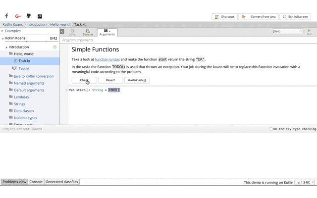
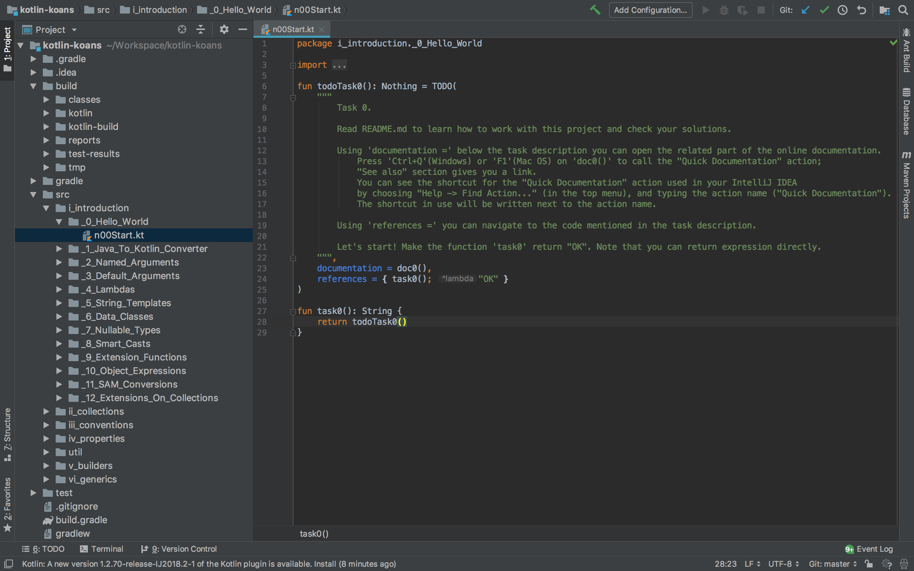
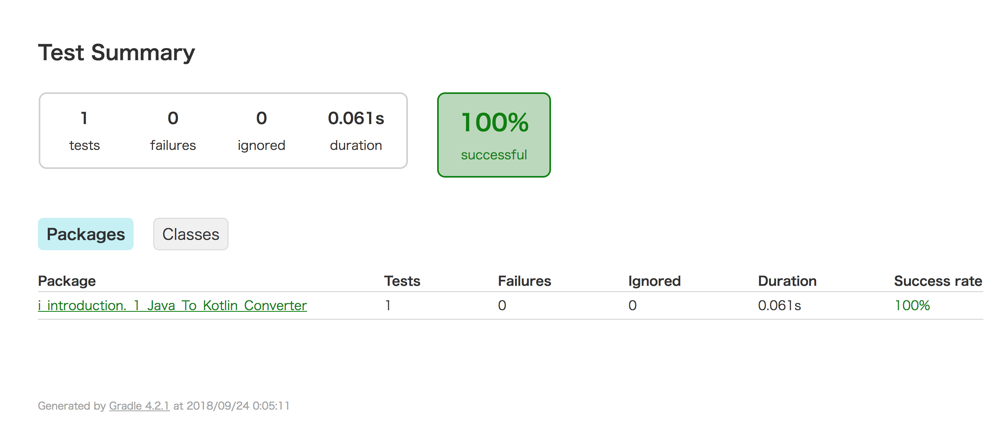
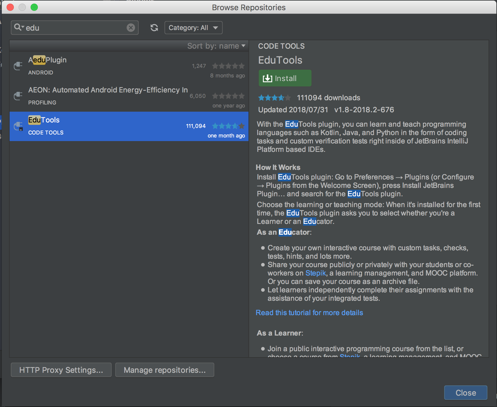
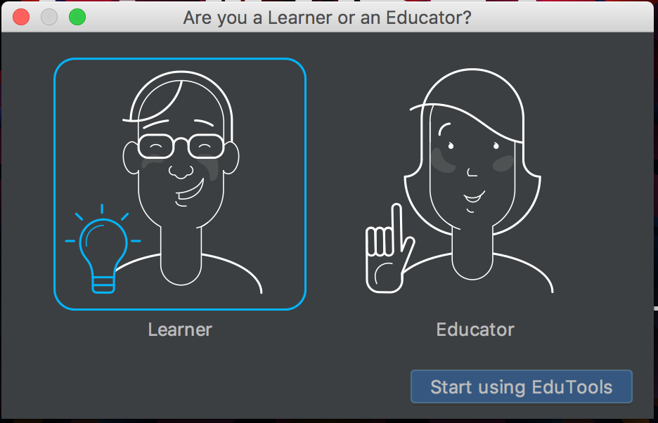
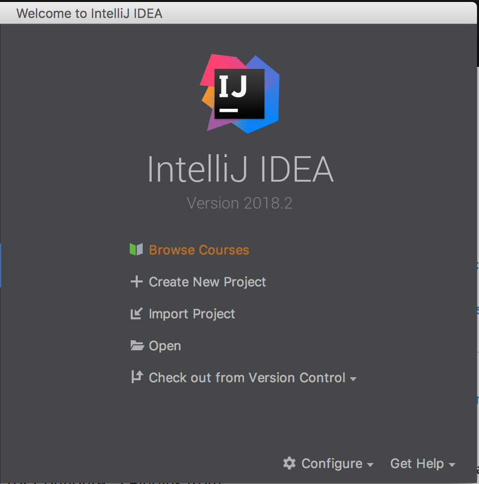
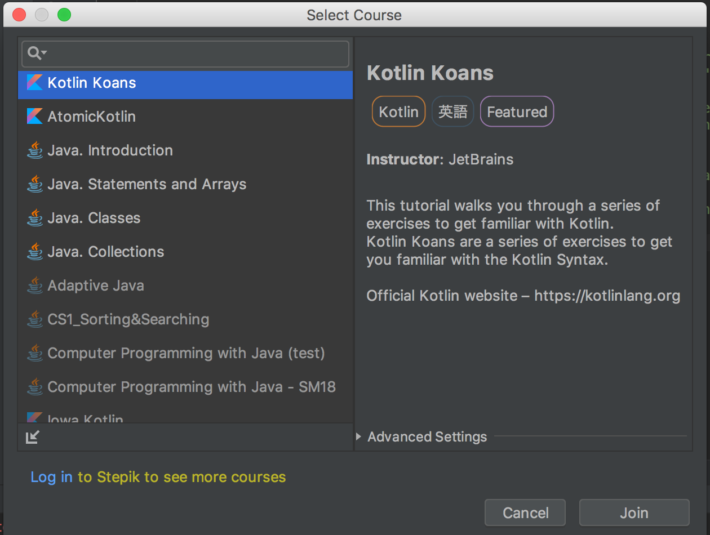
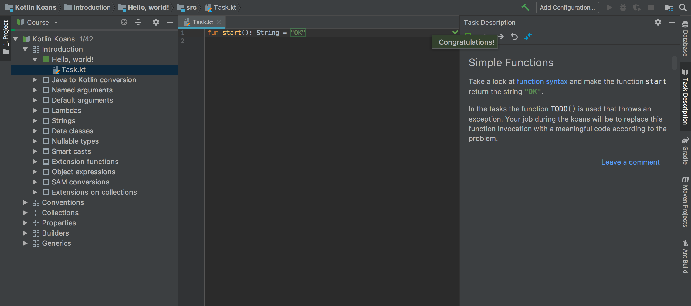

# 【Kotlin Koans】はじめるぞ！ 第0章 -準備-

ー挨拶ー

Kotlin、これからもっともっと人気が出てくるであろうプログラミング言語。

弊社内でも少しずつ採用範囲が広がってきていますが、よく耳にする声はやはり

「Kotlinを学びたいけどどこから始めたらいいかわからない。。。」

わかる、わかりみ、わかりてぃ。

可愛いKotlinには、そういう走り出しを支援してくれるステキな助言が[Kotlin公式リファレンス](https://dogwood008.github.io/kotlin-web-site-ja/docs/reference/)のトップに記載されています。

- [オンラインIDE](http://try.kotlinlang.org/)で遊んでみよう
- 書籍を読もう
- [Kotlin Koans](https://dogwood008.github.io/kotlin-web-site-ja/docs/tutorials/koans.html)に挑戦しよう

また、[日本Kotlinユーザグループ](https://kotlin.connpass.com/)では、Kotlin入門のための助走読本という日本語教科書が提供されています。

と、いくつか勉強方法のアドバイスがある中、今回はKotlin Koansにフォーカスします。

## Kotlin Koans とは

[Kotlin Koans](https://dogwood008.github.io/kotlin-web-site-ja/docs/tutorials/koans.html)

> インタラクティブなプログラミング演習

とある通り、Kotlinのプログラミング問題集です。

Koans＝コーアンズと呼びます。

名前の由来は「公案」という日本語から来ているそうです。禅問答のことらしい。オシャレ。

Kotlin Koansには、40問ちょいの問題が用意されています。

本記事は、それを日本語で解説してみるをテーマに書き進めます。

初回は準備編、第0章です。

# Kotlin Koans 第0章 -準備-

## オンラインで学習する

オンラインとは、[Try Kotlin](http://try.kotlinlang.org/koans) というWeb上のエディタで学習することを指します。



このようなWeb上のエディタがあります、左カラムに演習があり、それをひとつずつ解いていきます。

コードを書く、テストを実行する、カンニングする、が気軽に行えます。

このように、ローカルに開発環境が備わっていなくても、Webブラウザ上で気軽に学習することができます。

## オフラインで学習する

オフラインとは、ローカルで学習することを指します。

[Kotlin KoansのGitHubリポジトリ](https://github.com/Kotlin/kotlin-koans)に、オンラインと同等のプログラムが用意されているので、これを利用して学習ができます。

（以降、[IntelliJ IDEA](https://www.jetbrains.com/idea/)前提で話を進めます。ぜひ[こちらの記事](https://tech.askul.co.jp/entry/2018/07/11/171443)も合わせてご覧ください！）

リポジトリからソースをローカルに落として、GradleプロジェクトとしてIntelliJ IDEAで開きます。



このようにパッケージに1問ずつ入っているので、todo になっているところにコードを書いていきます。

テスト実行の際は、`gradlew` コマンドで行い、ターミナルで確認できます。
```
./gradlew test // すべてのコードをテストしたいとき
./gradlew test --tests i_*01* // 設問を指定してテストしたいとき
```

また、テスト実行結果は都度htmlで出力されるので、そちらを確認するのもアリです。

`~/kotlin-koans/build/reports/tests/test/index.html`



もし問題がわからないーとなってカンニングをしたい際は  `resolutions` ブランチに切り替えると素敵な世界が見えるかと。

## EduTools で学習する

先程は、GitHubリポジトリを落としてきてローカルで学習する方法を記載しました。

ですが、 [EduToolsプラグイン](https://plugins.jetbrains.com/plugin/10081-edutools)を使うことで、より学習に集中することができます。

`plugins` メニューより、EduToolsをインストールします。



インストール後、再起動すると、学習者かどうか質問されますので、Learnerを選びます。



すると新規メニューに `Browse Courses` が追加されます。



そこでKotlin Koansがあるのでそれを選びます。



すると `Task Description` というメニュー付きのプロジェクトが開かれます。



設問も見やすく、テスト実行も右メニュー上のボタンで簡単に行えます。

## 今回の成果

今回は、Kotlin Koansをはじめていくにあたっての準備を行いました。

Try Kotlin、GitHubリポジトリ、EduTools、みなさまお好みの環境は整いましたか？

次回からは、整えた環境で実際にKoansを解いていこうと思います。

それではまた！